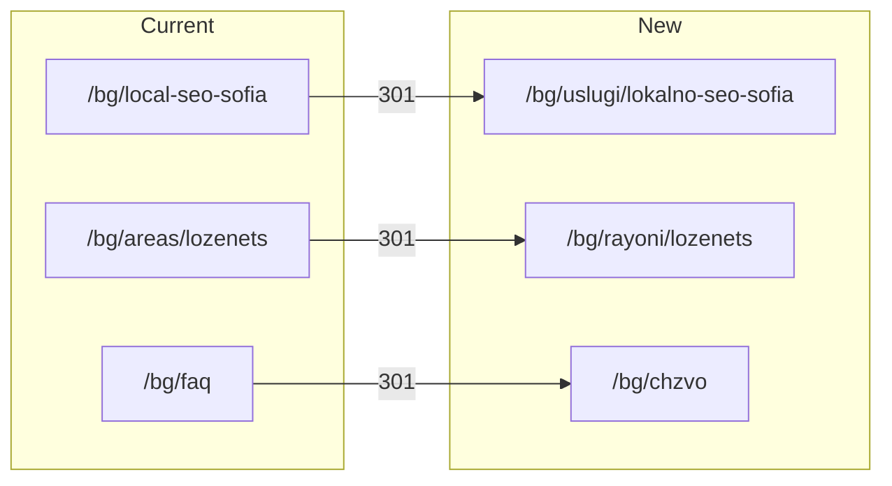

# Latin URL Path Restructure

## SEO note on redirects

**Without 301 redirects**, old URLs become 404s. Google Search Console can help get new URLs crawled faster (resubmit sitemap, URL Inspection → "Request indexing"), but it does **not** transfer ranking signals from old URLs to new ones.

**With 301 redirects**, link equity and indexed URLs consolidate onto the new paths. This is the standard Local SEO practice for URL migrations.

**Recommendation:** include permanent 301 redirects for every old path. GSC remains useful afterward to accelerate discovery of the new canonical URLs.

---

## Target URL mapping

Locale prefix stays unchanged (`/bg/...`, `/en/...`). Examples below show paths after locale.

### Service pages → `/uslugi/`

| Current path | New path |
|---|---|
| `/internet-marketing-service` | `/uslugi/internet-marketing-sofia` |
| `/marketing-agency` | `/uslugi/marketing-agenciya-sofia` |
| `/seo-optimization-sofia` | `/uslugi/seo-optimizaciya-sofia` |
| `/local-seo-sofia` | `/uslugi/lokalno-seo-sofia` |
| `/google-maps-ranking-sofia` | `/uslugi/google-maps-klasirane-sofia` |
| `/citation-building-sofia` | `/uslugi/izgrazhdane-citacii-sofia` |

### Area pages → `/rayoni/`

| Current path | New path |
|---|---|
| `/areas/lozenets` | `/rayoni/lozenets` |
| `/areas/mladost` | `/rayoni/mladost` |
| `/areas/lyulin` | `/rayoni/lyulin` |
| `/areas/iztok` | `/rayoni/iztok` |

Neighborhood slugs (`lozenets`, `mladost`, etc.) are already Latin — only the parent segment changes.

### Legal/info pages → Latin slugs

| Current path | New path |
|---|---|
| `/faq` | `/chzvo` |
| `/terms` | `/usloviya` |
| `/privacy` | `/poveritelnost` |
| `/cookie` | `/biskvitki` |

---

## Architecture change



### 1. Central paths registry (new file)

Create [`src/lib/paths.ts`](src/lib/paths.ts) as the single source of truth:

```typescript
export const paths = {
  services: {
    internetMarketing: "uslugi/internet-marketing-sofia",
    marketingAgency: "uslugi/marketing-agenciya-sofia",
    seoOptimization: "uslugi/seo-optimizaciya-sofia",
    localSeo: "uslugi/lokalno-seo-sofia",
    googleMapsRanking: "uslugi/google-maps-klasirane-sofia",
    citationBuilding: "uslugi/izgrazhdane-citacii-sofia",
  },
  areas: { lozenets: "rayoni/lozenets", mladost: "rayoni/mladost", ... },
  legal: { faq: "chzvo", terms: "usloviya", privacy: "poveritelnost", cookie: "biskvitki" },
} as const;

export function localePath(locale: string, path: string) {
  return `/${locale}/${path}`;
}
```

Each page imports its path from here instead of a local `const PATH`. Footer, breadcrumbs, and inline links use the same constants.

### 2. Move route folders under `src/app/[locale]/`

| From | To |
|---|---|
| `internet-marketing-service/` | `uslugi/internet-marketing-sofia/` |
| `marketing-agency/` | `uslugi/marketing-agenciya-sofia/` |
| `seo-optimization-sofia/` | `uslugi/seo-optimizaciya-sofia/` |
| `local-seo-sofia/` | `uslugi/lokalno-seo-sofia/` |
| `google-maps-ranking-sofia/` | `uslugi/google-maps-klasirane-sofia/` |
| `citation-building-sofia/` | `uslugi/izgrazhdane-citacii-sofia/` |
| `areas/{slug}/` | `rayoni/{slug}/` |
| `faq/` | `chzvo/` |
| `terms/` | `usloviya/` |
| `privacy/` | `poveritelnost/` |
| `cookie/` | `biskvitki/` |

Delete empty `areas/` directory after moves.

### 3. Update all path references

**Page components (10 service/area + 4 legal = 14 files):**
- Replace local `PATH` / `path` constants with imports from `paths.ts`
- Update canonical URLs, OpenGraph URLs, JSON-LD breadcrumb `item` URLs
- Area pages: breadcrumb hub `/${locale}/areas` → `/${locale}/rayoni` ([`areas/lozenets/page.tsx`](src/app/[locale]/areas/lozenets/page.tsx) and 3 siblings)
- Hardcoded inline links in TSX (e.g. [`seo-optimization-sofia/page.tsx:329`](src/app/[locale]/seo-optimization-sofia/page.tsx), [`local-seo-sofia/page.tsx:463`](src/app/[locale]/local-seo-sofia/page.tsx), all 4 area pages linking to SEO page)

**Layout components:**
- [`src/components/layout/footer.tsx`](src/components/layout/footer.tsx) — 6 service links + 3 legal links (currently hardcoded English paths)
- [`src/components/home/faq.tsx`](src/components/home/faq.tsx) — `/faq` link

**Messages (~60 href entries in each locale):**
- [`messages/bg.json`](messages/bg.json) and [`messages/en.json`](messages/en.json) — all `related.items[].href` and `footer.serviceAreas.featuredLinks[].href` values

**Sitemap:**
- [`src/app/sitemap.ts`](src/app/sitemap.ts) — update all paths; also add currently missing pages (`local-seo-sofia`, `google-maps-ranking-sofia`, `citation-building-sofia`, `mladost`, `lyulin`, `iztok`) under new paths

**Cursor rules (docs only):**
- [`.cursor/rules/seo-principles.mdc`](.cursor/rules/seo-principles.mdc) — update `/areas/[slug]` references to `/rayoni/[slug]`

### 4. Add 301 redirects

Add `redirects()` to [`next.config.ts`](next.config.ts) covering:
- Locale-prefixed old paths: `/:locale(bg|en)/local-seo-sofia` → `/:locale/uslugi/lokalno-seo-sofia` (× all 14 old paths)
- Locale-less old paths: `/local-seo-sofia` → `/uslugi/lokalno-seo-sofia` (proxy will attach preferred locale on rewrite for non-redirect hits; redirects fire first)

This ensures bookmarks, external links, and indexed URLs resolve correctly.

### 5. Post-deploy GSC checklist

After deploy:
1. Resubmit [`/sitemap.xml`](src/app/sitemap.ts) in Google Search Console
2. URL Inspection → request indexing for top priority URLs (homepage, main service pages, featured area pages)
3. Monitor **Pages** report for 404s on old paths (should drop to zero if redirects work)
4. Optional: use **Removals** only if duplicate old URLs appear in search results despite redirects (usually unnecessary with 301s)

---

## Files touched (summary)

| Category | Files |
|---|---|
| New | `src/lib/paths.ts` |
| Route moves | 14 `page.tsx` files (git mv) |
| Config | `next.config.ts`, `src/app/sitemap.ts` |
| Components | `footer.tsx`, `home/faq.tsx` |
| Messages | `bg.json`, `en.json` |
| Docs | `.cursor/rules/seo-principles.mdc` |

No changes needed to [`src/proxy.ts`](src/proxy.ts) locale logic — it passes through any valid path segment after locale detection.

---

## Verification

- `pnpm build` — confirm all routes compile
- Spot-check: `/bg/uslugi/lokalno-seo-sofia`, `/bg/rayoni/lozenets`, `/bg/chzvo`
- Confirm old URLs return 301 to new URLs (both `/bg/old-path` and locale-less `/old-path`)
- Footer, related-links sections, and FAQ "read more" link resolve to new paths
